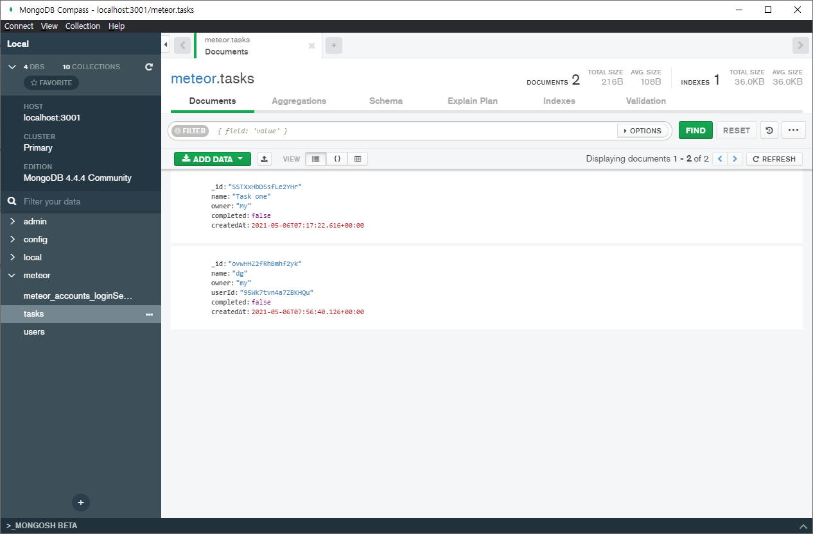

## sample-code

meteor + react 샘플 코드입니다.

### 실행

    meteor

기본적으로 App은 localhost:3000, MongoDB는 3001 포트에서 동작합니다.

### 추가 패키지 설치

    meteor npm install --save @babel/runtime react react-dom moment @fortawesome/fontawesome-free

### 프로젝트 구성

```
sample-meteor-react
├─ .meteor              // Meteor 빌드 파일
├─ client               // Client Main 진입점
│  ├─ main.css
│  ├─ main.html
│  └─ main.jsx
├─ imports              // Client - Server에서 Load 할 데이터
│  ├─ db
│  │  └─ collections.js
│  └─ ui
│     ├─ app.css
│     ├─ app.jsx        // App Main 코드
│     ├─ navbar
│     ├─ task
│     ├─ tasks_list
│     └─ task_form
├─ server               // Server Main 진입점
│  ├─ main.js
│  └─ publish.js        // DB Publish 코드

```

# 기본 코드 가이드

## Database

### imports/db/collections.js

새 Collection을 생성하고 Client, Server측 코드에서 각각 import하여 접근 가능합니다.  
실제 DB Collection은 Server에 생성이 되고, Client에서는 Memory 상에 존재하는 MiniMongo로 동작합니다.

    export const tasksCollection = new Mongo.Collection('tasks');

DB 접근은 MongoDB의 Find, Insert, Remove, Update 관련 함수를 사용합니다.  
Meteor 프로젝트를 처음 생성하면 DB 관련한 insecure, autopublish 패키지때문에 바로 DB 접근이 가능합니다.  
이 샘플 코드에서는 insecure, autopublish 패키지를 삭제하고 따로 권한 확인을 구현했습니다.

    const tasks = tasksCollection
      .find(taskFilter, { sort: { createdAt: 1 } })
      .fetch();
    const pendingCount = tasksCollection
      .find({ ...userFilter, ...completedFilter })
      .count();

해당 코드는 Meteor.methods를 통해서 구현할 수도 있습니다.  
https://react-tutorial.meteor.com/simple-todos/08-methods.html

### server/publish.js

Collection의 Insert, Remove, Update 권한을 확인합니다.  
아래 코드는 간단히 Login 했는지 여부(UserId), 입력하려는 Document의 userId 값이 현재 유저와 같은지 비교하여 True/False를 Return 합니다.  
False 가 Return 되면 브라우저 Console 창에서 access deny 로그가 출력됩니다.

    tasksCollection.allow({
        insert(userId, doc) {
            return userId && doc.userId === userId;
        },
        ...

DB의 Publish를 구현합니다.  
아래 코드는 임의로 DB에서 데이터가 들어오는데 시간 지연을 발생하는 코드를 추가했습니다.  
db에서 find 조건에 따라 특정 User의 데이터, Paging을 위한 데이터 갯수 등을 변경할 수 있습니다.

    Meteor.publish('tasksCollection', function publishTasks() {
        // for testing
        const wakeUpTime = Date.now() + 1000;
        while (Date.now() < wakeUpTime) {}
        return tasksCollection.find({ userId: this.userId }, { limit: 5 });
    });

### imports/ui/app.jsx

Server에서 Publish한 Collection을 Subscribe 합니다.  
handler 변수를 설정하면 ready가 되지 않았을 때 별도 Spinner나 Loading 문구를 출력할 수 있습니다.  
이 샘플 프로젝트에서는 1초정도 Loading이 표시됩니다.

    const subHandler = Meteor.subscribe('tasksCollection');
    if (!subHandler.ready()) {
        return { ...noData, isLoading: true };
    }

## React Hook

### imports/ui/app.jsx

기본적으로 React Hook을 이용해서 UI를 구현합니다.  
Meteor와 관련된 State(DB 변경, User Login)는 Custom Hook인 useTracker를 사용합니다.

    import { useTracker } from 'meteor/react-meteor-data';
    ...
    const user = useTracker(() => Meteor.user());
    const [hideCompleted, setHideCompleted] = useState(false);
    ...

## Routing

Paging 을 위해서 react-router를 사용합니다.  
기본 페이지, /test 페이지, 404 페이지가 구현되어 있습니다.

    <Router>
      <Switch>
        <Route exact path="/">
          ...
        </Route>
        <Route path="/test">
          ...
        </Route>
        <Route path="*">
          ...
        </Route>
      </Switch>
    </Router>

# Meteor 기본 설정

새로 Meteor 프로젝트를 시작할 때 설정 방법입니다.

### 프로젝트 생성

    meteor create sample    // sample project 생성

### 패키지 설치

    meteor add/list/remove  // Atmosphere에 등록된 패키지 관리
    meteor npm ...          // npm에 등록된 패키지 관리. 반드시 meteor를 붙여야함

### DB 관련 패키지 삭제

다음 패키지는 Prototyping을 위해 기본으로 설치되어 있습니다.  
DB 연동에 관련한 구현이 완료되면 관련 패키지를 삭제하고 보안관련 구현을 해야합니다.

    meteor remove insecure     // DB insert, remove, update에 권한 확인 구현 필요
    meteor remove autopublish  // DB Publish, Subscribe 구현 필요

### css module

PostCss의 module, autoprefix 등을 위해서는 아래 패키지를 설치합니다.

https://github.com/akanix42/meteor-css-modules

    meteor add nathantreid:css-modules

### DB 확인

MongoDB Compass, Robo 3T 등의 툴로 DB확인이 가능합니다.  

